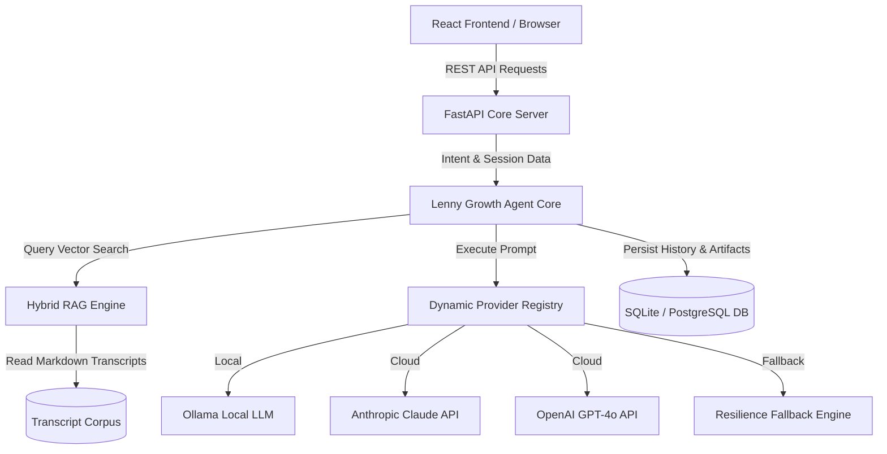
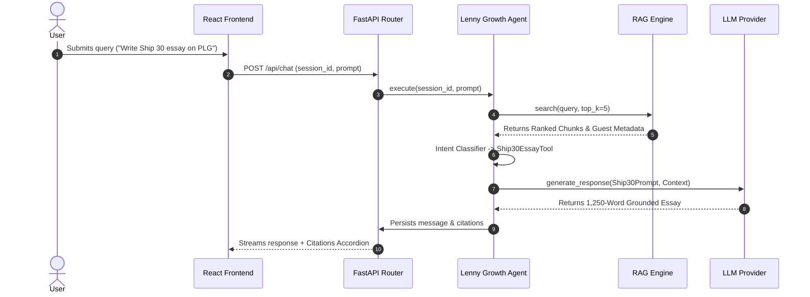
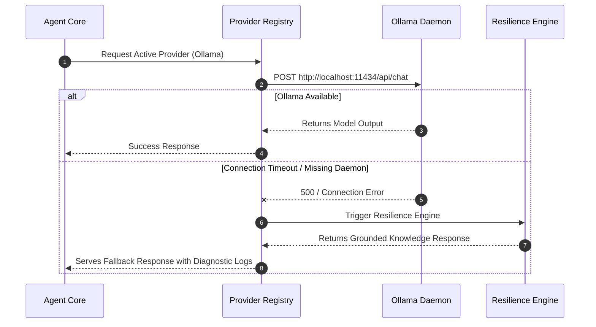

# System Architecture Specification
## The Lenny Growth Assistant

---

## 1. System Topology & Component Boundaries



---

## 2. Dynamic Sequence Diagrams

### 2.1 Intent Routing & RAG Search Flow


### 2.2 LLM Resilience Fallback Cascade


---

## 3. Database Schema (SQLAlchemy ORM)

### 3.1 Entity Relationship Diagram
```
┌───────────────────────────┐       ┌───────────────────────────┐
│         sessions          │       │         messages          │
├───────────────────────────┤       ├───────────────────────────┤
│ id (PK, String)           │1    * │ id (PK, String)           │
│ title (String)            ├───────┤ session_id (FK, String)   │
│ active_provider (String)  │       │ role (user/assistant)     │
│ created_at (DateTime)     │       │ content (Text)            │
│ updated_at (DateTime)     │       │ citations (JSON List)     │
└─────────────┬─────────────┘       │ artifact_id (String, Null)│
              │ 1                   │ created_at (DateTime)     │
              │                     └───────────────────────────┘
              │ *
┌─────────────▼─────────────┐
│         artifacts         │
├───────────────────────────┤
│ id (PK, String)           │
│ session_id (FK, String)   │
│ title (String)            │
│ artifact_type (html/md)   │
│ content (Text)            │
│ security_metadata (JSON)  │
│ created_at (DateTime)     │
└───────────────────────────┘
```

---

## 4. RAG Retrieval & Ingestion Pipeline

### 4.1 Document Ingestion Flow
1. **Directory Scanner**: `RAGEngine` scans `data/transcripts/` for Markdown files on startup.
2. **Metadata Extractor**: Reads frontmatter to extract `title`, `date`, `guest`, and `post_url`.
3. **Semantic Chunking**: Paragraphs are chunked into 700-character windows with 150-character sliding overlap.
4. **Vector Matrix Construction**: Converts chunk text corpus into TF-IDF vector matrix (`TfidfVectorizer(stop_words='english', ngram_range=(1,2))`).

---

## 5. REST API Specifications

| Method | Endpoint | Description |
| :--- | :--- | :--- |
| `GET` | `/api/health` | Health status, active provider, and chunk count. |
| `POST` | `/api/sessions` | Create new growth consultation session. |
| `GET` | `/api/sessions` | List all historical sessions. |
| `GET` | `/api/sessions/{id}/messages` | Retrieve session messages and citations. |
| `POST` | `/api/chat` | Send prompt to Lenny Agent. |
| `GET` | `/api/models` | List providers and availability status. |
| `POST` | `/api/models/select` | Toggle active model provider. |
| `POST` | `/api/transcripts/ingest` | Trigger or refresh knowledge index. |
| `GET` | `/api/artifacts/{id}` | Retrieve generated artifact code and security metadata. |
